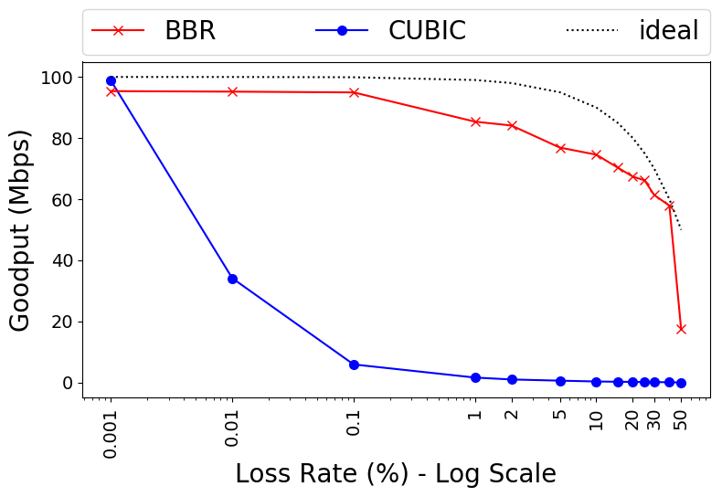

### ReBBR: Reproducing BBR Performance on Lossy Networks

 
 
 
 
 

<small>Luke Hsiao and Jervis Muindi</small>  
<small>June 2017<small>

---

#### Introduction: BBR Congestion-based Congestion Control  

- Tries to maximize throughput and minimize latency
- Does so by estimating the bottleneck bandwidth and round-trip propagation
  delay

---?image=http://deliveryimages.acm.org/10.1145/3030000/3022184/vanjacobson1.png

---

#### Sub-Result: BBR performs better than CUBIC in Lossy Networks  
- We focus on the claim that BBR is better than CUBIC in networks with
  non-negligible loss rates.
- Illustrates one of the most obvious differences between a loss-based
  congestion control algorithm and a congestion-based algorithm.
- CUBIC's loss tolerance is a property of the algorithm. BBR's loss tolerance
  is a configuration parameter.

---

<small>
BBR vs. CUBIC throughput for 60-second flows on a 100Mbps/100-ms link with
0.001% to 50% random loss.
</small>

---

#### Experimental Setup  
- Ubuntu 16.04 LTS upgraded with [v4.11.1](http://kernel.ubuntu.com/~kernel-ppa/mainline/v4.11.1/) of the Linux kernel
- [Mahimahi](http://mahimahi.mit.edu/) Network Emulator
- Google Cloud `n1-standard-2` instance
- Infinite buffer on bottleneck link
- 6.25MB maximum send and receive window sizes

---

#### Reproducing Figure 8

- Our results agree with the published figure, with minor differences
  - Like the original, CUBIC achieves slightly better throughput than BBR for
    extremely low loss rates.
  - In our experiments, we don't see BBR throughput drop until about 45% loss
    unlike the original paper. This is likely due to a difference in the
    implmenentation of the loss process in mahimahi vs. the netem-based
    emulation used by the authors.

Note:
Specifically, there are two possible factors: (1) the size of the initial
congestion window can result in the current BBR code pacing packets one RTT
later than CUBIC would (discussed in this developer thread), and (2) the
current implementation of the ProbeRTT mechanism prioritized simplicity over
performance, which can result in ~2% penalty in throughput because BBR spends
those portions of time with a minimal number of packets in flight.

+++

